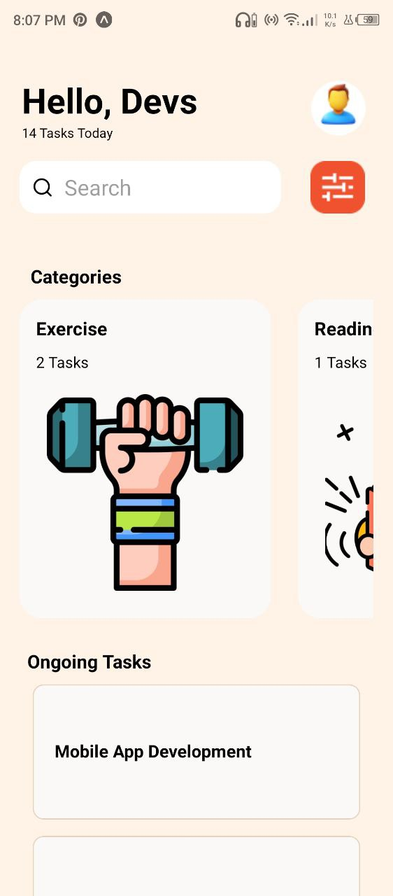
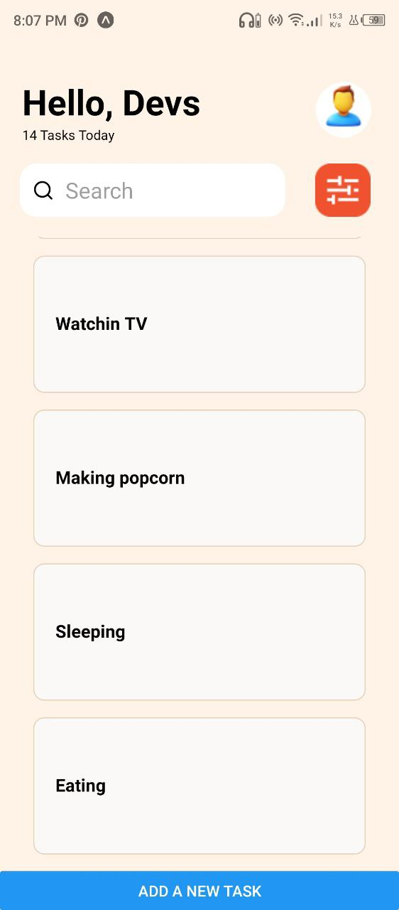

# rn-assignment3-11339613

# NANA ESSENEY YENTUMEY

## Basic Components In My App:

### View

The `<View>` component is the most basic component of a react native app which is generally used to contain other components.

### Text

The `<Text>` component is used to display text.

### Image

The `<Image>` component is used to display images.

### Textinput

The `<Textinput>` component is used it take user input in the form of text.

### ScrollView

The `<ScrollView>` component is used to a scrollable container for other components. The direction of scrolling can be vertical or horizontal (vertical by default).

###  StyleSheet

The `StyleSheet` component is used to provide styling for other components. It is created outside the main function of the .js file to be exported.

### Button

The `<Button>` component is used to render a clickable button for handling events.

### FlatList

The `<FlatList>` component is used to render scrollable lists.

## Custom Components In My App:

### SearchBar

The `<SearchBar \>` component was made using the `<TextInput>` component and imported an imported expo vector icon. It provides an interface for the user to search for ongoing tasks.

### Categories

The `<Categories \>` component was made using the `<ScrollView>` component. In order to make the component scroll sideways instead of vertically as it does by default, the `horizontal` property was set to `true` using `horizontal={true}` in the opening tag of the `<ScrollView>` component.

## Screenshots of the App:

